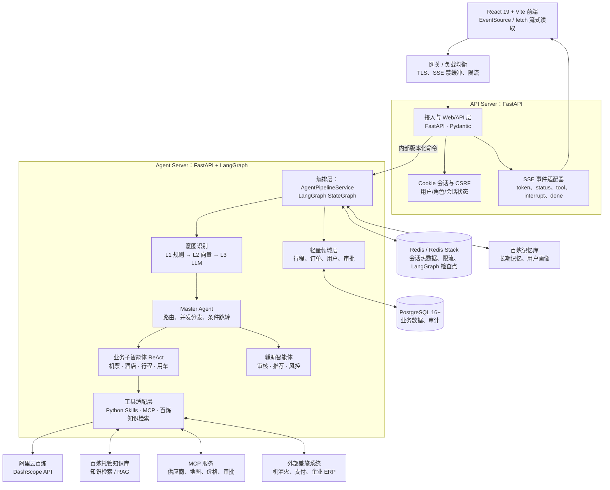

# 企业级智能旅行助手技术选型

> 文档状态：技术与实施基线，已与 Feature `001-travel-assistant-mvp` 的 Spec Kit 产物同步。  
> 适用范围：Python 企业级智能差旅多智能体系统。  
> 基线时间：2026-08-17。

## 1. 结论摘要

推荐采用“**三个业务运行单元 + 一个受限工具安全单元、契约优先、边界清晰**”的 Python 架构：React Web、FastAPI API Server、FastAPI + LangGraph Agent Server 分别开发、测试和部署；另设 Tool Gateway 与 Egress Proxy 承担远程 HTTP MCP / Skill 的白名单、隔离和审计。API Server 承担异步 HTTP、Cookie/CSRF、安全校验和 SSE 网关；Agent Server 作为多智能体有状态编排内核；SQLModel 仅在 G7 解锁后管理少量业务实体。PostgreSQL 保存业务事实，Redis 保存检查点与热数据；大模型、长期记忆和 RAG 分别统一接入阿里云百炼（DashScope API、记忆库、托管知识库/知识检索）。

三个业务运行单元可按 HTTP/SSE 连接数与模型/工具吞吐独立扩缩容；共享内容仅限版本化契约，不共享跨边界业务实现。远程工具遵循《远程工具沙箱与真实只读接入基线》：真实只读调用可在局部门禁满足后启用，无完整 Provider 配置则拒绝；所有真实外部写入保持禁用。

## 2. 整体架构图



## 3. 技术栈清单

下表版本为当前建议的稳定大版本或最低锁定范围；生产环境应在 `pyproject.toml` 与锁文件中锁定精确版本，并经兼容性测试后升级。

| 层级 | 推荐技术 | 版本建议 | 用途与说明 |
| --- | --- | --- | --- |
| 运行时 | Python | 3.12.x | 兼顾成熟生态、类型系统和异步性能；所有核心包均要求 Python ≥3.10。 |
| 接入层 | React 19、Vite、TypeScript、Ant Design 6、Zustand | 以项目锁文件为准 | SSE 使用 `EventSource`；命令使用携带 Cookie/CSRF 的 `fetch`，不在前端存储会话令牌。 |
| Web/API | FastAPI | `>=0.135,<0.140` | 异步路由、依赖注入、OpenAPI、Pydantic 校验、原生 SSE 支持。 |
| ASGI 运行器 | Uvicorn | `>=0.30,<0.40` | 生产使用多 worker / 容器副本横向扩展；仅承载无状态 API 与流连接。 |
| 数据校验与配置 | Pydantic、pydantic-settings | `>=2.10,<3`、`>=2.0,<3` | 请求/响应 DTO、Agent 状态辅助模型、环境配置。 |
| 浏览器鉴权 | FastAPI `Security`、服务端会话 Cookie、CSRF 校验 | 随 FastAPI | 企业预置账号密码登录后设置 `HttpOnly`、生产环境 `Secure`、适当 `SameSite` Cookie；前端不保存令牌，不接受前端透传 `user_id` 作为身份依据。 |
| 编排层 | LangGraph | `>=1.2,<2` | 多 Agent 状态图、条件边、子图、流式事件、检查点、HITL 中断恢复。 |
| LLM/工具抽象 | LangChain Core | 与 LangGraph 兼容锁定 | 将 Python 函数声明为结构化 Tool，并复用消息、模型与工具协议；避免引入过多高层链式封装。 |
| Redis 检查点 | langgraph-checkpoint-redis、redis | `>=0.5,<0.6`、`>=8,<9` | 将图检查点持久化到 Redis；生产 Redis 需具备 RedisJSON 与 RediSearch（Redis 8+ 或 Redis Stack）。 |
| 领域与 ORM | SQLModel | `>=0.0.39,<0.1` | 简单实体同时具备 Pydantic 数据模型与 SQLAlchemy ORM 能力，不引入 Repository 基类。 |
| 数据库驱动 | SQLAlchemy、asyncpg | `>=2.0,<3`、`>=0.30,<1` | PostgreSQL 异步访问；SQLModel 底层使用 SQLAlchemy，复杂查询可直接使用 SQLAlchemy 2.x API。 |
| 数据库迁移 | Alembic | `>=1.18,<2` | 仅用于可审计的 schema 迁移。 |
| 关系数据库 | PostgreSQL | 16+ | 已确认。保存订单、行程、审批、运行索引与审计事实；不承担 RAG 向量存储。 |
| 大模型 | DashScope SDK / 百炼兼容 API | 实施时锁定模型版本 | 已确认采用阿里云百炼 API；通过统一 `ChatModel` 适配器隔离 SDK，不能将供应商调用直接渗透至 Agent 节点。 |
| MCP | mcp、langchain-mcp-adapters | `>=1.27,<2`、`>=0.3,<0.4` | MCP 客户端/服务端与 LangGraph Tool 适配；MCP 2.x 目前为 alpha，不进入生产基线。 |
| L2 意图路由 | DashScope Embedding、LangGraph `InMemoryStore` | 模型、维度实施前锁定 | 以预置意图样本做语义 Top-1 匹配；仅用于进程内只读路由索引。 |
| 长期记忆 | 百炼记忆库 API | 以百炼稳定 API 为准 | 跨会话记忆片段、用户画像与语义召回；由应用适配器注入提示词。 |
| RAG | 百炼托管知识库、知识检索 API | 以百炼稳定 API 为准 | 托管文档解析、向量/关键词混合检索、排序与引用片段返回；不引入 pgvector。 |
| 可观测性 | OpenTelemetry、structlog | `>=1.0,<2`、`>=25,<26` | 贯通 `request_id`、`thread_id`、`user_id`、模型调用和工具调用；敏感提示词须脱敏。 |
| 测试与质量 | pytest、pytest-asyncio、ruff、mypy | 按团队基线锁定 | 覆盖状态图路由、工具幂等、SSE 事件契约和中断恢复。 |

### PostgreSQL、百炼记忆库与百炼知识库的职责边界

- **PostgreSQL**：唯一的业务事实与审计索引来源，保存订单、行程、审批、运行元数据和外部资源关联 ID；不保存 RAG 向量或百炼长期记忆副本。
- **百炼记忆库**：保存跨会话的用户偏好、画像和关键事件。检索按服务端用户 Scope 和角色权限过滤，应用只取回与当前请求相关的少量记忆并注入提示词；不替代订单、审批等业务主数据。
- **百炼托管知识库/知识检索**：承担 RAG 文档解析、索引和检索，支持向量与关键词混合检索及排序；应用仅保存知识库 ID、文档来源标识、权限映射和检索审计，不自行创建 pgvector 表。

进入实现前仍须确认具体的千问模型、Embedding 模型与版本、知识库数据来源/地域、知识保留周期、文档权限到用户和角色的映射，以及相关调用配额和成本上限。

## 4. 核心库的选择理由

### 4.1 Web 框架：FastAPI

选择 FastAPI，而不是 Flask / Django / Sanic，原因如下：

| 候选 | 结论 | 与本系统的匹配度 |
| --- | --- | --- |
| **FastAPI（推荐）** | 采用 | ASGI 原生异步、Pydantic 驱动的请求校验、依赖注入和 OpenAPI 文档齐全。FastAPI 0.135 起原生提供 `EventSourceResponse`，可直接由异步迭代器输出 SSE。 |
| Flask | 不作为主框架 | WSGI 与同步心智模型更适合普通 CRUD；处理大量长连接和异步 Agent 流时，需要更多扩展与约束。 |
| Django | 不作为主框架 | 管理后台、ORM 完备但偏重；本项目明确要求轻量领域层，内建 ORM/管理体系会增加不必要复杂度。 |
| Sanic / Starlette | 备选 | 性能优秀，但前者的企业生态与文档广度不及 FastAPI，后者更低层，需要自行补齐校验与文档体验。 |

FastAPI 的 SSE 实现会自动采用 `text/event-stream`，并提供 keep-alive、`Cache-Control: no-cache` 与 `X-Accel-Buffering: no` 等基础处理；代理层仍需验证流超时和缓冲配置。[FastAPI SSE 文档](https://fastapi.tiangolo.com/tutorial/server-sent-events/)

### 4.2 编排框架：LangGraph

选择 LangGraph 作为核心编排，而不是直接使用 AutoGen、CrewAI 或仅使用 LangChain 高层 Agent，原因是本系统的重点是**可恢复的有状态业务流程**，而非快速拼装对话角色。

| 候选 | 结论 | 关键差异 |
| --- | --- | --- |
| **LangGraph（推荐）** | 采用 | 用状态图表达 L1/L2/L3、主控路由、并行子图和条件边；原生提供持久化检查点、异步流和动态 `interrupt`，适合 Human-in-the-Loop。 |
| AutoGen | 不作为主编排 | 擅长会话式多角色协作；对可审计、可恢复、条件驱动的业务工作流，需要自行补足状态机与持久化治理。 |
| CrewAI | 不作为主编排 | 上手快、角色和任务抽象高，但复杂控制流与中断恢复的显式性较弱，难以成为订单类核心事务的工作流内核。 |
| 仅 LangChain Agent | 不作为主编排 | 适合单 Agent ReAct；多 Agent 路由、状态持久化、回放与人工暂停仍应落在 LangGraph 图层。 |

LangGraph 可以独立使用，也能选用 LangChain 的模型和工具组件；其公开定位覆盖 durable execution、streaming、human-in-the-loop 与 persistence。[LangGraph 概览](https://docs.langchain.com/oss/python/langgraph/overview)

### 4.3 领域与 ORM：SQLModel

SQLModel 适合当前“轻量领域层”的原因，是让少量稳定业务实体（如 `Trip`、`Order`、`Approval`）以较少重复代码同时满足 Pydantic 数据校验和关系映射，而不是建设重型 DDD 基础设施。

| 好处 | 对本系统的实际价值 |
| --- | --- |
| Pydantic 与 ORM 模型统一 | 字段类型、默认值和校验规则可复用，减少请求 DTO、领域对象与 ORM 实体之间的漂移。 |
| 保留 SQLAlchemy 能力 | SQLModel 基于 SQLAlchemy 与 Pydantic；异步 session、事务、关联加载、复杂查询和连接池治理仍采用 SQLAlchemy 2.x，不会被简化层锁死。 |
| 适合轻量领域 | 不强制 Repository 基类。应用服务注入 `AsyncSession`，用实体和明确查询函数处理订单、行程与审批，减少样板代码。 |
| 与 FastAPI 契合 | 同属 Pydantic 类型体系，接口边界更容易保持显式和一致。 |

边界：不要把数据库实体原样作为所有接口响应，订单、审计和内部状态仍应使用独立 Pydantic DTO。复杂多表报表、批量写入或 PostgreSQL 特性场景可直接使用 SQLAlchemy Core/ORM；当前不需要预先引入 Repository 或 Unit of Work 框架。

## 5. 核心模块设计建议

### 5.1 API 与账号会话边界

- 浏览器登录会话：通过 `HttpOnly`、生产环境 `Secure`、适当 `SameSite` Cookie 持有；前端不得读取、存储或伪造会话令牌。所有会改变服务端状态的 Cookie 请求必须通过 CSRF 校验。
- 服务间调用：API Server→Agent Server 采用 Docker Compose Secret `api_agent_internal_token` 承载共享内部 Token；两端只读 `/run/secrets/api_agent_internal_token`，由 FastAPI 依赖项校验 Bearer Token，不能写入环境变量、镜像或日志。浏览器 `X-User-Id`、角色或 `thread_id` 不可信；Agent 仍须二次校验用户归属和角色。
- 账号处理：P0 只接受企业内部预置账号密码登录，建立服务端 Cookie 会话，并支持退出与自然过期；不提供注册、短信、隐私同意、账号删除、账号禁用或自助凭据管理。
- 所有请求生成或透传 `request_id`；SSE、日志、Agent 状态和审计记录均携带该关联标识。
- 在入口生成 `trace_id`，并在 REST、SSE 生命周期、API↔Agent 命令、LangGraph 节点、百炼/记忆/RAG、Skill 与关键数据库访问间透传；`request_id`、`run_id`、`thread_id` 用于缩小检索范围。
- 使用 `structlog` 输出结构化运行日志、OpenTelemetry 传递 Trace；所有接口只记录字段白名单、脱敏请求/响应摘要、内容长度/哈希、耗时、状态码、供应商请求 ID 与错误摘要。API、Agent 和 Tool Gateway 统一复用 `packages/sensitive-masker` 中的 `SensitiveMasker`：API Key 全量遮盖，密码/token 等 KV 秘钥保留键名遮盖值，手机号、身份证、银行卡和邮箱部分遮盖。不得默认记录完整原始报文。
- 运行日志与 PostgreSQL `AuditEvent` 分离：前者服务排障与性能分析，后者记录业务事实；两者通过关联标识互查。日志平台、字段脱敏规则、访问控制、保留期限、原文例外留存和告警责任人须在上线前确认。
- 前端不可自行伪造其他用户的 `thread_id`；服务端必须从经校验的用户、角色与会话上下文构造它。

### 5.2 SSE 流式输出

建议拆为“创建/续跑任务”和“订阅事件”两类接口，避免一次普通 POST 因网络断开而失去会话控制权：

| 接口示例 | 责任 |
| --- | --- |
| `POST /api/v1/conversations/{conversation_id}/runs` | 校验输入，创建或启动 LangGraph run，立即返回 `run_id` 与 `thread_id`。 |
| `GET /api/v1/runs/{run_id}/events` | 以 SSE 持续推送运行事件；支持 `Last-Event-ID` 断线续读。 |
| `GET /api/v1/runs/{run_id}` | 前端状态轮询兜底，返回 `running`、`interrupted`、`completed` 或 `failed`。 |
| `POST /api/v1/runs/{run_id}/resume` | 提交审批/补充信息，通过 `Command(resume=...)` 恢复同一 `thread_id`。 |

事件应使用稳定的契约而非裸文本：`token`（模型增量文本）、`status`（节点进度）、`tool_call` / `tool_result`（面向可展示的脱敏摘要）、`interrupt`（待人工输入）、`error`、`done`。每条事件写入单调递增 `event_id`；短期缓存在 Redis，浏览器重连时用 `Last-Event-ID` 补发。长任务的最终状态与审计日志落 PostgreSQL。

SSE 只承载服务端到客户端的单向流；用户审批与追问通过普通 POST 提交。SSE 连接断开不应取消已启动的图运行，除非用户明确发送取消请求。

### 5.3 L1/L2/L3 意图识别与主控路由

意图识别采用 L0～L3 逐层短路。L0 只负责判定明确单意图、明确多意图或不确定；L1/L2/L3 统一输出 `IntentRecognitionResult`，至少包含 `intent_code`、`agent_key`、`confidence`、`source`（`RULE` / `VECTOR` / `LLM`）、`matched_rule_or_sample_id`、`required_slots`、`missing_slots` 与 `trace_id`。

```text
用户输入
  │
  ▼
L0：明确多意图 / 不确定 ───────────────────────────────────────────► L3
  │ 明确单意图
  ▼
L1：关键词 / 正则 ──唯一最终命中──► RULE 结果 ─► Master / 子 Agent（跳过 L2/L3）
  │ 无命中                         │ 两个及以上命中
  ▼
L2：DashScope Embedding + InMemoryStore Top-1 ──最终命中──► VECTOR 结果 ─► 单意图 + 高置信 + 白名单：直跳子 Agent
  │ 未命中                                                       └─ 其他安全场景：Master 路由
  ▼
问题改写（仅一次）→ 重走 L0/L1/L2 → 仍未命中 → L3 百炼 LLM 结构化识别 → Master 路由
```

1. **L0：单/多意图判别**。只允许输出明确单意图、明确多意图或不确定；句子长度只能作为启发式信号。多意图和不确定直接进入 L3。
2. **L1：规则识别**。仅在 L0 明确单意图时采用关键词、正则与标准化词典。唯一最终命中产出 `RULE` 结果并跳过 L2/L3；两个及以上命中直接进入 L3；状态陈述混合多个连续动作、但无法可靠拆成多个最终规则意图时，不得被其中一个关键词短路，应标记为非最终未命中并进入 L2/一次问题改写/L3 消歧。
3. **L2：向量识别**。将受控意图样本写入启动时构建的 LangGraph `InMemoryStore` 索引。先判断 Top-1 是否达到 0.75：未达到才允许问题改写一次；达到后，Top-1/Top-2 同意图直接命中，不再要求分差；不同意图时，分差大于 0.05 命中 Top-1，分差不大于 0.05 判为模糊并直接交给 L3/Master 澄清。改写后重走 L0/L1/L2，仍未形成结果才进入 L3。
4. **直跳条件**：`RULE` 或 `VECTOR` 结果满足“单意图 + 高置信 + `agent_key` 在当前配置版本的子 Agent 白名单中”时，直接进入对应子 Agent。阈值须通过标注集与压测评估后配置；涉及写操作仍须经过工具审批。
5. **L3：LLM 兜底**。仅在 L0 多意图/不确定，或一次改写后 L1/L2 仍未形成最终结果时调用百炼 LLM，以 JSON Schema / Pydantic 结构化输出消歧、补充意图、槽位和动作。服务端必须校验输出并限制 `agent_key` 到白名单。
6. Master Agent 读取统一结果和会话状态执行条件分支、并发协作与异常回退，不重新猜测已确认意图；低置信度、缺少关键槽位、多意图冲突、写操作或政策例外进入澄清/审批节点。

`InMemoryStore` 只用于开发测试或“应用启动后加载、进程内只读”的 L2 意图样本索引，不是生产持久化 Store，也不是长期记忆。多副本部署时，每个副本必须从同一版本化配置源加载样本和阈值，更新通过发布或受控热加载完成。

当前最小实现已接入 L0/L1：规则唯一命中仅记录 `direct_dispatch`、目标 Agent、意图码和来源 `RULE` 到 Redis 检查点；L0 多意图、L1 歧义或未命中记录为 `clarify` 并将 Run 切换至 `clarifying`。这不是对模型路由或业务子 Agent 的替代，后续 L2/L3 启用后仍须遵守同一白名单和人工确认边界。

### 5.4 ReAct 智能体工具调用

每个业务子智能体由一个受限的 LangGraph 子图承载：模型负责“推理、选择工具、阅读观察结果和生成下一步”，工具层负责“校验、执行和审计”。

1. 为每个 Python Skill 使用 Pydantic 入参/出参模型，声明名称、描述、超时、是否只读、幂等键和所需审批等级。
2. 工具注册实行白名单：机票查询 Agent 无法取得支付或订单提交工具；不将任意 Python 函数暴露给模型。
3. 读操作可由 Agent 自主调用；产生外部副作用的操作（占座、下单、退款、发消息）由 `HumanInTheLoopMiddleware` 在 Tool 执行前统一审批，并保留服务端幂等与权限校验。
4. 工具调用统一注入 `user_id`、角色、`request_id` 和 `idempotency_key`，服务端覆盖模型提供的用户和角色字段。
5. 工具结果用结构化 Observation 回写状态；向前端暴露的事件需要去除价格协议、证件、密钥与第三方原始报文。

Python Skills 使用 LangChain Core 的 Tool 适配；外部 MCP 工具通过 `langchain-mcp-adapters` 转为同一种 Tool 协议。该适配器直接面向 LangChain/LangGraph；MCP Python SDK 当前稳定生产线为 v1.x，v2 仍为 alpha。[适配器说明](https://pypi.org/project/langchain-mcp-adapters/)；[MCP Python SDK 说明](https://pypi.org/project/mcp/)

### 5.5 Human-in-the-Loop：Middleware 与显式中断的组合

HITL 应使用 Middleware，但不应只使用 Middleware。每个 ReAct 子 Agent 接入 LangChain `HumanInTheLoopMiddleware`，统一拦截有外部副作用的 Tool；顶层 LangGraph 的业务节点保留显式 `interrupt()`，处理工具调用之外的流程级人工协作。

| 场景 | 推荐机制 | 原因 |
| --- | --- | --- |
| 占座、下单、改签、退款、向外部系统发消息 | `HumanInTheLoopMiddleware` | 在模型产出 Tool Call 后、实际执行前统一按工具名拦截，支持 approve / reject / edit，避免每个工具重复审批样板。 |
| 信息补全、多个方案人工选择、预算/政策例外、审核 Agent 复核 | `interrupt()` 业务节点 | 这些暂停不由某一个 Tool Call 引起，需要携带领域状态、候选方案和审批上下文。 |
| 供应商 API 的最终写入 | Tool 内幂等与权限校验 | Middleware 是编排层防线，不能替代服务端强制校验、用户资源隔离和幂等控制。 |

`HumanInTheLoopMiddleware` 运行在 `create_agent()` 编译出的 LangGraph 内，不是另一套运行时；可将带 Middleware 的子 Agent 作为节点/子图放入顶层 `StateGraph`。它需要持久化 checkpointer 与稳定 `thread_id` 才能中断后恢复。[Middleware 概览](https://docs.langchain.com/oss/python/langchain/middleware/overview)；[HITL Middleware 文档](https://docs.langchain.com/oss/python/langchain/human-in-the-loop)

LangGraph 的 `interrupt()` 在节点中暂停图执行，持久化检查点后等待外部输入；以同一 `thread_id` 调用 `Command(resume=...)` 继续运行。[LangGraph Interrupt 文档](https://docs.langchain.com/oss/python/langgraph/interrupts)

建议的运行状态机如下：

```text
created → running → interrupted ──(approve / reject / supplement)──→ running
                   │                                                │
                   └──────────────── cancel ───────────────────────┤
                                                                    ↓
                                                         completed / failed / cancelled
```

- 图编译时配置 Redis checkpointer；使用 `thread_id` 作为恢复游标。`langgraph-checkpoint-redis` 提供异步 Redis saver，但需要 RedisJSON 与 RediSearch；Redis 8+ 已内置二者，旧版本应使用 Redis Stack。[Redis 检查点库](https://pypi.org/project/langgraph-checkpoint-redis/)
- PostgreSQL 记录 `run_id`、`thread_id`、当前状态、版本号、审批人、审计摘要和最终结果；Redis 保存图检查点和短期事件缓存。Redis 不是唯一审计事实来源。
- 任何 `interrupt()` 前的外部副作用必须幂等，或拆到独立节点并在审批后执行，因为恢复会从中断所在节点的起点重新运行。[LangGraph 中断规则](https://docs.langchain.com/oss/python/langgraph/interrupts)
- 当前开发基线的 Redis Run 检查点 TTL 已确认为 **7 天（604800 秒）**。订单相关会话在完成审批/审计归档前不得仅依赖 Redis；备份、灾备与生产环境的个人信息保留期限仍属于上线前必须确认的安全与合规决策。

## 6. 已确认的技术选型

| 决策项 | 已确认策略 |
| --- | --- |
| 大模型 API | 阿里云百炼（DashScope API）。 |
| 关系数据库 | PostgreSQL 16+。 |
| 长期记忆 | 百炼记忆库。 |
| RAG | 百炼托管知识库与知识检索 API。 |
| 意图识别 | L0 单/多/不确定判别 → L1 关键词/正则 → L2 DashScope Embedding + `InMemoryStore` → 一次改写 → L3 百炼 LLM 兜底；L1/L2 最终命中跳过 L3，白名单单意图高置信可直跳子 Agent。 |
| HITL | ReAct 子 Agent 的敏感工具用 `HumanInTheLoopMiddleware`；流程级协作使用 LangGraph `interrupt()`。 |
| 浏览器会话 | HttpOnly、Secure、SameSite Cookie + CSRF；前端不持有 Bearer Token。 |
| 账号生命周期 | P0 账号由企业内部预置；仅支持登录、退出和会话过期，账号删除、禁用及凭据管理不在范围内。P0 内存基线采用 Argon2id、8 小时会话、按账号/IP 在 15 分钟内最多 5 次连续失败；生产参数、初始化脚本和持久化方案仍须经 G2/G7 审核。 |

目录结构已按三运行单元、契约包和 G7 迁移边界固化在[目录结构文档](./企业级智能旅行助手目录结构.md)；实际文件路径与阶段任务以 Feature 任务清单为准。

## 7. 实施前仍需确认的决策

本文只完成技术选型，没有落地上述任一外部资源。开始实现前，请确认以下事项，以避免错误锁定架构、安全和成本边界：

1. **百炼模型与成本策略**：目标生成模型、Embedding 模型与版本、地域、预算、限流及降级方案。百炼知识库的向量模型与维度由托管能力约束，仍需以实际创建配置为准。
2. **记忆与知识数据边界**：记忆库/知识库的业务空间、Scope 设计、知识来源、用户资源隔离、检索权限映射、保留策略及数据是否允许进入百炼。
3. **PostgreSQL schema 与保留策略**：P0 已确认用户、会话、消息、Run、审计、行程/政策的实体边界、索引、保留期限和迁移方案；订单、预订、审批、报销及 RAG 向量表仍未解锁。备份、灾备、生产访问授权和自动清理作业仍须在上线前单独评审。
4. **审批边界**：哪些操作必须人工确认（例如预算超标、占座、下单、改签、退款），以及审批超时和回退策略。
5. **会话与安全**：Redis checkpoint 开发基线为 7 天；Cookie/CSRF 部署策略、审计保存时长、个人信息脱敏、账号数据保留、备份与灾备指标仍需上线前确认。
6. **部署形态**：容器/Kubernetes、期望并发与 SSE 连接规模、是否已有 API 网关和可观测性平台。
7. **日志与排障策略**：日志平台、字段级脱敏规则、检索权限、保存/删除期限、采集失败告警，以及是否存在经加密和审计的原始报文例外留存场景。

## 8. 参考资料

- [FastAPI：Server-Sent Events](https://fastapi.tiangolo.com/tutorial/server-sent-events/)
- [LangGraph：概览](https://docs.langchain.com/oss/python/langgraph/overview)
- [LangGraph：流式输出](https://docs.langchain.com/oss/python/langgraph/streaming)
- [LangGraph：中断与恢复](https://docs.langchain.com/oss/python/langgraph/interrupts)
- [百炼：记忆库](https://help.aliyun.com/zh/model-studio/memory-library)
- [百炼：知识库](https://help.aliyun.com/zh/model-studio/user-guide/rag-knowledge-base/)
- [百炼：知识检索](https://help.aliyun.com/zh/model-studio/rag-knowledge-retrieval)
- [MCP Python SDK（稳定 v1.x 说明）](https://pypi.org/project/mcp/)
